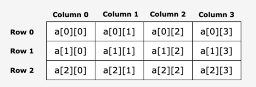
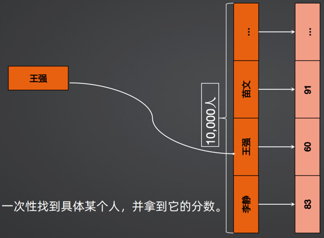

# Ready To Go

## INDEX

****
## 🟧 Module I

## 环境配置
## 变量 常量
## 计算符号 字符串
## 条件 分支表达式 循环
****
## 🔶 数组 切片
### 🔸 数组 [link](https://github.com/AdaSheng07/ready.to.go/blob/56ec88917763f732b33170478d0e1d794ec9bef9/chapter1/006.array1/main.go)  
数组是具有相同唯一类型的一组已编号且长度固定的数据项序列，即由固定长度的特定类型元素组成的序列。  
这种类型可以是任意的原始类型例如整型`int`、字符串`string`、浮点型`float`或者自定义类型。

相对于去声明 `number0, number1, ..., number99` 的变量，使用数组形式 `numbers[0], numbers[1] ..., numbers[99]` 更加方便且易于扩展。

**数组的声明与初始化**
```
var variable_name [SIZE] variable_type = [SIZE]variable_type{......}
var variable_name = [SIZE]variable_type{......}
variable_name := [SIZE]variable_type{......}
```
如果数组的长度不确定，可以用`...`代替数组的长度，编译器将根据数组中的元素个数自行推断数组的长度。
```
e := [...]int{1, 2, 3, 4}
```
设置数组长度以后，还可以通过指定下标来初始化元素：
```
age := [5]int{1:24,4:35}
```

**数组的特性**
- 属于变量，固定长度，固定类型，动态赋值（运行过程中数组的元素值可以改变）
- 数组的类型由数组的元素类型和数组的长度两者决定，长度和元素类型一旦定义，都不可变：
  ```
  ages3 := [5]int{34, 75, 25, 57, 24}
  ages3 = [6]int{34, 75, 25, 57, 24, 99} // 报错：ages3的类型type是[5]int，不能重复赋值为[6]int
  ```

**数组的常规操作**
- 数组是变量，可以对整个数组进行动态赋值
- 数组中的每个元素也是变量，可以对数组中的每个元素进行动态赋值，注意下标从`0`开始，不可越界为元素赋值
- 数组有固定长度，可用`len()`求出数组长度
- 可用`for range`搭配访问每个元素：
  ``` go
  var array2 [3]int = [3]int{1, 2, 3}
  for i := 0; i < len(array2); i++ {
      fmt.Println(array2[i])
  }
  for i, val := range array2 {
      fmt.Printf("%d, array2[%d]: %d\n", array2[i], i, val)
      fmt.Printf("%d\t%d\n", i, val)
  }
      
  /*
  1
  2
  3
  1, array2[0]: 1
  0       1
  2, array2[1]: 2
  1       2
  3, array2[2]: 3
  2       3
  */
  ```
### 🔸 多维数组 [link](https://github.com/AdaSheng07/ready.to.go/blob/d5077093f5549509d58f58ed096831d06cffd7aa/chapter1/006.array2/main.go)

**多维数组的声明**

声明一个`n`维数组：
```
    var variable_name [SIZE1][SIZE2]...[SIZEn]variable_type
    
    e.g. var a [3][3]int
```
一组方括号`[]`定义的是一个一维数组，多组方括号`[][]`或者`[][][]`或者任意多`[]`的定义多维数组。

以下方的二维数组为例，二维数组可认为是一个表格，`x`为行，`y`为列，二维数组可以通过`a[i][j]`来表示。



**初始化二维数组**

```
    方式一：数组长度有限
    variable_name := [SIZE1][SIZE2]variable_type{}
        variable_name[0] = [SIZE2]variable_type{......}
        variable_name[1] = [SIZE2]variable_type{......}
        ...
        variable_name[SIZE1 - 1] = [SIZE2]variable_type{......}
    
    variable_name := [SIZE1][SIZE2]variable_type{
        [SIZE2]variable_type{......}
        [SIZE2]variable_type{......}
        ...
        [SIZE2] variable_type{......}
    }
    
    方式二：优化数组长度管理，支持动态添加
    variable_name := [...][SIZE2]variable_type{
        [SIZE2]variable_type{......}
        [SIZE2]variable_type{......}
        [SIZE2]variable_type{......}
        ...
    }
```
**多维数组的遍历**

多维数组的遍历通过`for-loop`层层降维，也可以用`for range`访问每个元素。对于一个`n`维的数组：
```
    for d1, d1val := range array{
        for d2, d2val := range d1val{
            for d3, d3val := range d2val{
            ...
            }
        }
    }
```
再以二维数组为例：
``` go
    c := [...][3]string{
            [3]string{"take", "take", "take"},
            [3]string{"go", "go", "go"},
            [3]string{"fine", "fine", "fine"},
        }
    for d1, d1val := range c {
        for d2, d2val := range d1val {
            fmt.Println(d1, d1val, d2, "val =", d2val)
        }
    }
```

### 🔸 数组与切片的比较

切片是对数组的抽象。数组的长度是不可改变的，
而相比之下，切片是一种更加灵活，功能更多的内置类型，可以理解为一种变长数组，或者动态数组。
切片的长度是不固定的，可以利用`append`追加元素，在追加时可能使切片的容量增大。

在实际开发运用中，极少情况下才会使用数组，大部分情况下使用切片。
使用数组的特定情况：
- 初始化内容
- 固定数组，固定长度，内容不会做变更
- 节省内存空间，切片会自动扩容与空间释放

### 🔸 切片的声明与初始化 [link](https://github.com/AdaSheng07/ready.to.go/blob/02c813c001594cca665171f452d097302ca9f901/chapter1/007.slice1/main.go)

一个切片在未初始化之前默认为`nil`，长度为`0`。切片的声明方式有：
```
  方式一：声明未指定大小的数组来定义切片
  var slice_name []type 
  * 注意：切片声明时不需要说明长度
  
  方式二：内置函数 make() 初始化切片
  var slice_name []type = make([]tape, length, capacity)
  slice_name := make([]type, length, capacity)
  * 注意：capacity是可选参数，length是数组的长度，也是切片的初始长度
  
  方式三：引用数组
  var array_name [array_size]type
  slice_name := [array_name:]
  slice_name := array_name[startIndex:endIndex]
  
  方式四：引用切片
  var slice1_name []type
  slice2_name := [slice1_name:]
  slice3_name := slice1_name[startIndex:endIndex]
```

### 🔸 切片的操作

**动态增加、删除、截取切片中的元素** [link](https://github.com/AdaSheng07/ready.to.go/blob/02c813c001594cca665171f452d097302ca9f901/chapter1/007.slice1/main.go)
1. 利用`append`对切片进行追加、插入和删除元素的操作

- 切片没有直接的删除操作
- `slice_name[lower-bound:upper-bound]`的区间是**左闭右开**的
- 用`append`插入元素时会覆盖原有元素，需要提前做备份，如何做一份有效备份？
  ```
  a := []int{6, 4, 2, 0}
    
  1. Invalid, backup changes while a changes:
  backup := a[1:] 
    
  2. Valid, backup does not change as a changes: 
  backup := append([]int{}, a[1:]...)
    
  3. Valid, backup does not change as a changes:
  var backup []int = make([]int, len(a[1:]), cap(a[1:])*2)
  copy(backup, a[1:])
  ```
2. 还可以利用`make`对切片进行扩容
```
  make(slice_name type, len(slice_name), cap(slice_name))
```
3. 利用`copy`拷贝切片的内容
- 在拷贝`source`切片到`destination`切片之前，需要先声明`destination`切片并初始化容量为`source`切片的两倍（可用`make`）
- 语法：`copy(dst []Type, src []Type)`

**`Golang`支持`string`与`byte`、`rune`切片之间的转换** [link](https://github.com/AdaSheng07/ready.to.go/blob/02c813c001594cca665171f452d097302ca9f901/chapter1/007.slice2/main.go)
- 只做特定的支持：`string array`与`byte slice`之间的切换，其它的类型如`int`等是无法转换为`byte slice`的
- 为了表示更多字符，`Golang`字符串实现基于`UTF-8`编码，也支持`ASCII`码方式逐字符访问
- 在`Golang`中，通过`rune`类型,可以方便地对每个`UTF-8`字符进行访问
- 如果仅使用`byte`来读取、转换、写入字符，一般不会出现，但如果继续使用`byte`对字符进行修改，则会出现字符非`ASCII`码的问题

**Appendix**

☞  [Go 字符串编码，Unicode 和UTF-8](https://segmentfault.com/a/1190000019361462)  
☞  [GO操作切片数组时不当，数据被覆盖](https://blog.csdn.net/weixin_44145242/article/details/111299356)  
☞  [Go 字符串编码，Unicode 和UTF-8](https://segmentfault.com/a/1190000019361462)
****

## 🔶 Map

`Map`是一个`key-value`组合的结构体，一种无序的键值对的集合，常用实现方式是二叉树和哈希表（散列表）。
`Map`通过`key`来快速检索数据，`key`的作用类似于数组与切片中的索引，指向数据的值`value`。
`key`总是唯一的，相同的`key`拿到相同的`value`，更新`value`时，会覆盖相同`key`的原有`value`值。

### 🔸 使用`Map`的优势：快速查找，从`key`定位到`value`

当数据量很大时，e.g. >10000，仍然用数组或者切片来存储，会出现什么问题？

如果我们需要查找数据集合中的某一组数据，需要`for-loop`遍历整个数组/切片，再比较值是否相等来锁定目标数据，时间复杂度是`O(n)`，很大。

如果在总共` 10000 `人中找第` 5000 `个人` 2000 `次，一共在切片上比较`5000 * 2000`次，效率太低。

`Map`是为了解决这样的问题而存在的，只要数据组中的每一组数据都是是唯一的，我们就可以用`key-value`构造`Map`来进行存储。



### 🔸 `Map`的定义与初始化 [link](https://github.com/AdaSheng07/ready.to.go/blob/0bc031aec6339e4f13d7ab4705546030a8ec0dc6/chapter1/008.map1/main.go)

定义`map`时注意`key`与`value`的类型都需要声明。
`map`定义可以是符合类型，它的`key`与`value`都可以是任意类型，e.g. `int`,`float64`, `array`, `slice`, etc.

主要有两种定义方式：
```
  1. use keyword `map` to declare and initialize
  var map_variable_name map[key_data_type]value_data_type
  map_variable_name := map[key_data_type]value_data_type{}
  map_variable_name := map[key_data_type]value_data_type{key1: value1, key2: value2, key3: value3, ...}
  
  2. use keyword `map` to declare, then use built-in function make() to initialize
  var map_variable_name map[key_data_type]value_data_type
  map_variable_name = make(map[key_data_type]value_data_type, length)
  
  3. use built-in function make() to declare, then add in key-value elements
  map_variable_name := make(map[key_data_type]value_data_type, length)
  map_variable_name[key1] = value1
  map_variable_name[key2] = value2
  ...
 ```
`Map`定义的`key`与`value`类型可以**嵌套使用**，但要注意多层嵌套后代码意义是否会混淆，影响可读性，如：
```
  map_variable_name := map[string]map[string]map[int]float64{}
```

### 🔸 对`map`的操作 [link](https://github.com/AdaSheng07/ready.to.go/blob/0bc031aec6339e4f13d7ab4705546030a8ec0dc6/chapter1/008.map2/main.go)

如果不初始化/实例化`map`，就会默认初始化为`nil map`。`Map`不用实例化就可以读取和删除，但`nil map`**不能**用来写入/存放键值对：
```
  panic: assignment to entry in nil map
```

**`Map`的增删改查**

`Map`属于`Golang`的变量范畴，也是强类型的。当定义好`map`后，它只能容纳对应类型的数据。

>【回顾】如何在切片中间插入一个元素?
> 
> 备份切片扩容 >> 拷贝备份 >> 用`append`插入值 >> 用`append`结合备份与追加元素后的新切片

此操作的**风险高，代价大**，而`Map`的增删改查是极其方便的：

```
  1. add/change key-value
  map_variable_name[key_name] = key_value
  * If this key does not exist in map, add this key-value pair in map; 
    else, change its value in the map.
  
  2. delete key-value
  delete(map_variable_name, key)
  * We can delete the same key repeatedly from map.
  
  3. lookup key-value：take key as index of map
  map_variable_name[key]
```
【注意】如果此时`map`中不存在这个`key`，会自动加入此`key`，但返回的`value`是**假值**。  

> 如何判断验证真假值（`key`在`map`中是否存在）呢？
> ```
> value, ok := map_variable_name[key]
> * If ok is true, value is a true value;
>   else if ok is false, value is a false value.
> ```


**`Map`的遍历**
```
  for key, value := range map_variable_name {
      fmt.Printf("%v\t%v\n", key, value)
  }
  
  for key := range map_variable_name{
      fmt.Println(map_variable_name[key])
  }
```

**`Map`的合并**
```
  map_variable_name1, map_variable_name2 := map[key_type]value_type, map[key_type]value_type
  map_variable_name1[key1] = value1
  map_variable_name2[key2] = value2
  for k, v := range map_variable_name1{
      map_variable_name2[k] = v
  }
```

**Appendix**

☞   [Go 语言Map(集合)](https://www.runoob.com/go/go-map.html)  
☞   [Go语言map的创建](https://haicoder.net/golang/golang-map-make.html)

## 🟦 Module 1 Practice Collection

### 🔹 数组

> **Q1**  创建一个一维数组，并反转它  
>
>      [>>  How to Reverse an Array w/o Creating a New One?](https://github.com/AdaSheng07/ready.to.go/blob/76668b88b729bcbd51f76fcbb93e07b1997d2155/chapter1/006.reverseArray/main.go)

> **Q2**  用多维数组写一个日历表，需要考虑每个月的天数不同，以及是平年还是闰年来专门处理二月  
>
>      [>>  Print out Calendar of a Given Year](https://github.com/AdaSheng07/ready.to.go/blob/b21fd48ba4780bb7b5fc1dc8a919e1cd3ef14111/chapter1/006.calendar1/main.go)

> **Q3**  【提升篇】日历按照一周的宽度显示（第一列为周一），且每个日期匹配到对应的列
>
>      [>>  Print out Calendar w Weekdays of a Given Year (Advanced)](https://github.com/AdaSheng07/ready.to.go/blob/4f419675f04290dfedfaed716de0d752b912bd1f/chapter1/006.calendar2/main.go)  
>
>      ☞  [计算任何一天是星期几的几种算法](https://blog.csdn.net/luoyayun361/article/details/54881835)  
>      ☞  [golang向上取整、向下取整和四舍五入](https://studygolang.com/articles/12965)
### 🔹 切片
> **Q1**  创建一个一维整数切片，并用循环对它由从小到大排序
>       
> 
> **Q2**  对一副新扑克牌打乱顺序
>       
> 
> **Q3**  有一个包含中英文的切片，如果是英文的，转换它们的大小写
>       
>
> **Q4**  切片去重的实现
>       
>
### 🔹 Map 
> **Q1**  用 Map 管理 20人 的分数，并做如下操作：
> 1. 算出所有人的平均分
> 2. 根据分数高低对这 20 分排名，高分在前 
> 3. 相同分数的在同一行
>       []()

****

## 🟧 Module II

## 🔶 函数

函数是基本的代码块，用于执行一个任务，以达成预期目的。
在编程中，我们使用不同的函数，划分它们各自的功能，来完成不同的任务。
每个程序必须有命名为`main()`的主函数。

### 我们为什么需要函数？

- 将一段经常需要使用的代码封装起来，在需要使用时可以直接调用，提高代码的复用率
- 简化代码逻辑，提高代码效率
- 节省代码阅读成本，提高代码的可读性
- 当代码出现问题时，可以更快地锁定`Error`位置，提高可维护性
- 更新编写代码的思路：从顶层展开伪代码结构（目的、投入、预期、产出）再进行模块化落实  
  ...

### 函数的定义

完整的函数的定义格式如下：
```
  func function_name([parameter list])(return-value_list){
      // function body: executable statements
  }
```
`func`、函数名`function_name`、参数列表`[parameter list]`的括号`()`和函数体的大括号`{}`是必须的。
由`func`开始函数的声明，函数名`function_name`、参数列表`[parameterlist]`和返回值列表`return-value_list`构成了**函数签名**。

- 函数名`function_name`：
  - 函数的名称，在同一个包`(package)`里必须唯一
  - 函数是通过名称来调用的，名称一定要有意义
- 参数列表`[parameter list]`：
  - 形式参数，函数的输入项，是可选项
  - 参数列表如果为空，调用此函数时也不能有输入项
  - 如果参数列表不为空，当函数被调用时，可以将值传递给参数，这个值就是实际参数
  - 参数列表指定的内容：参数类型、顺序以及参数的个数
- 返回值列表`return-value_list`：
  - 调用函数后的产出结果通过返回值列表返回
  - 当有返回值列表时，函数体中必须有`return`来呼应与之匹配，否则报错
  - 有些函数的功能实现不需要返回值，返回值列表也是可选项，可以为空
- 参数和返回值可以是列表，表示可以传入多个参数，也可以返回多个参数
- 函数体`function body`：函数定义的可执行代码的集合

函数在定义时，根据预期目的的不同，会有很多**变种**：
- 只有函数名`function_name`（目的），没有参数列表`[parameter list]`（投入）、
  返回值列表`return-value_list`（预期和产出），是单纯的函数调用，可能用于：
  - 内容的输入输出
  - 加载全局变量
- 有函数名`function_name`（目的）和参数列表`[parameter list]`（投入），
  没有返回值列表`return-value_list`（预期和产出）

### 函数的参数

**定长参数与不定长参数**

- 定长参数：指定具体名称、类型，使用函数的时候必须一一对应，否则报错：
```
  func constructHello(name string) string {
      return fmt.Sprintf("hello, %s", name)
  }
  func main(){
      constructHello("Tom")
  }
```
- 不定长参数：除了指定名称、类型外，需要额外指定特殊符号`...`：
```
  func constructHello(name ...string) string {
      return fmt.Sprintf("hello, %s", name)
  }
  func main(){
      constructHello("Tom", "Jerry")
  }
```

**调用函数传递参数的方式**

函数使用的参数可称为函数的形式参数，可理解为**预期投入**，定义在函数体内的局部变量。

调用参数，可以通过两种方式来传递参数：
- 值传递
- 引用传递
看传的是什么 array map interface本身就是引用，传的时候，copy的是变量，但值是原来的值
int string是值传递
还有指针


调用函数，可以通过两种方式来传递参数：
值传递	值传递是指在调用函数时将实际参数复制一份传递到函数中，这样在函数中如果对参数进行修改，将不会影响到实际参数。
引用传递	引用传递是指在调用函数时将实际参数的地址传递到函数中，那么在函数中对参数所进行的修改，将影响到实际参数。
默认情况下，Go 语言使用的是值传递，即在调用过程中不会影响到实际参数。

### 函数的封装重构`refactor`

Goland中函数提取重构： 
- 选取函数片段 -> Refactor -> Extract Method... 
- 函数重命名：Refactor -> Rename

### `Golang`的内置函数

`Go`语言标准库提供了多种可动用的内置的函数。

| built-in functions | applications      | specification                                                             |
|--------------------|-------------------|---------------------------------------------------------------------------|
| `close()`          | 管道关闭              |                                                                           |
| `len()`            | 接受不同类型参数并返回该类型的长度 | 例如字符串、数组、切片、`map`和管道。<br/>如果我们传入的是字符串则返回字符串的长度，如果传入的是数组，则返回数组中包含的元素个数。    |
| `cap()`            | 接受不同类型参数并返回该类型的长度 | 用于返回某个类型的最大容量，例如切片和`map`，根据不同类型，返回意义不同。                                   |
| `new()`            | 内存分配              | 用于值类型和用户定义的类型，如自定义结构，将类型作为参数。                                             |
| `make()`           | 内存分配              | 用于内置引用类型（切片、map 和管道），将类型作为参数。<br/>`new(T)`分配类型`T`的零值并返回其地址，也就是指向类型`T`的指针。 |
| `copy()`           | 操作切片              | 复制切片，`copy(dst []Type, src []Type)`                                       |
| `append()`         | 操作切片              | 编辑切片，增删改，`append(slice, elem1, elem2)`，`append(slice, anotherSlice...)`   |
| `panic()`          | 错误处理              | 即使程序`panic`，`defer`函数仍然会照常调用                                              |
| `recover()`        | 错误处理              |                                                                           |
| `print()`          | 打印                |                                                                           |
| `println()`        | 打印                |                                                                           |
| `complex()`        | 操作复数              |                                                                           |
| `real()`           | 操作复数              |                                                                           |
| `imag()`           | 操作复数              |                                                                           |

defer函数 //todo

### 返回值 强烈建议命名返回值
### 将函数作为参数
**提取函数**
**使用函数**
### 特殊变量
### 特殊函数
**`init`函数**


**Appendix**
☞   [Go 语言向函数传递数组](https://www.runoob.com/go/go-passing-arrays-to-functions.html)  
☞   [Go 语言函数](https://www.runoob.com/go/go-functions.html)  


## 包
## 函数方法论

## 🟦 Module 2 Practice Collection

### 🔹 函数
> **思考：** 在同一个 Go 文件里能创建同名的函数吗？
>           如果能，会发生什么问题？
>           如果不能，怎么在同一个大项目中创建相同名字的函数？
